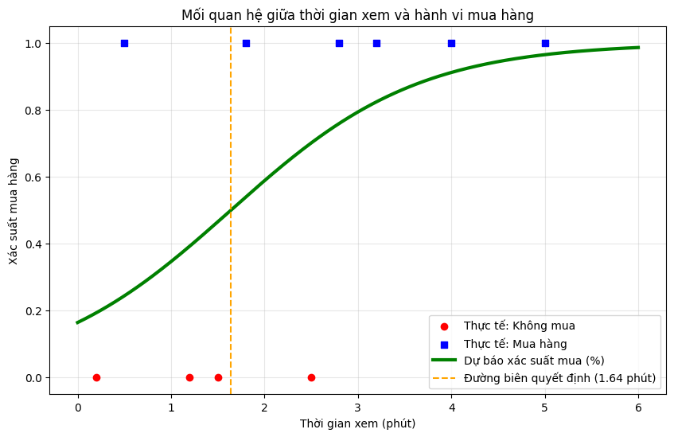

# Part 1.2 : Logistic regression

## 1. MÔ TẢ BÀI TOÁN (Problem Description)

- Bài toán: Một trang thương mại điện tử muốn tối ưu hóa chi phí quảng cáo. Họ thu thập dữ liệu về thời gian (phút) khách hàng xem video giới thiệu sản phẩm và việc họ có bấm "Mua ngay" sau đó hay không.
- **Dữ liệu đầu vào $(X)$ :** Thời gian xem video (phút).
    ◦ Ví dụ:  $X = [0.2, 0.5, 1.2, 1.5, 1.8, 2.5, 2.8, 3.2, 4.0, 5.0]$
- **Dữ liệu đầu ra $(y)$ :** Có mua hàng hay không?
    - 1 : có mua
    - 0 : không mua
- **Điểm đặc biệt:** Có những người xem rất ít nhưng vẫn mua (do cần gấp), và có người xem hết video vẫn không mua (chỉ xem cho vui). Dữ liệu không phân tách tuyến tính hoàn hảo.

---

## 2. PHÂN TÍCH VÀ CODE (Implementation)

Bài toán sử dụng mô hình logistic regression, chúng ta sẽ sử dụng hàm sigmoid để chuyển đổi từ thời gian xem chương trình (phút) sang xác suất có mua hàng hay không?

$z = w_0 + w_1 \cdot (\text{X})$

$P(y=1) = \sigma(z) = \frac{1}{1 + e^{-z}}$

Ta thấy giá trị của trọng số $w_1$ có vai trò rất lớn trong quá trình đánh giá việc khách hàng có mua sản phẩm hay không:

- Nếu $w_1$  có giá trị lớn ⇒ đồ thị dốc mạnh khách hàng chỉ cần xem qua 1 mốc cố định là sẽ mua hàng
- Nếu $w_1$  có giá trị nhỏ ⇒ đồ thị thoải mạnh thời gian xem chương trình không ảnh hưởng nhiều đến quyết định mua

Trước hết ta có 1 tập huấn luyện như sau :

| Thời gian xem | Quyết định mua hay không | Thời gian xem | Quyết định mua hay không |
| --- | --- | --- | --- |
| 0.2 | 0 | 2.5 | 0 |
| 0.5 | 1 | 2.8 | 1 |
| 1.2 | 0 | 3.2 | 1 |
| 1.5 | 0 | 4.0 | 1 |
| 1.8 | 1 | 5.0 | 1 |

```python
model = LogisticRegression(penalty=None) 
model.fit(X, y)

w0 = model.intercept_[0]
w1 = model.coef_[0][0]
```

w1: [[0.99213589]]
w0: [-1.62607675]

Tiếp theo chúng ta hãy vẽ đồ thị để thấy rõ hơn sự linh hoạt của hàm sigmoid

```python
plt.figure(figsize=(10, 6))

plt.scatter(X[y==0], y[y==0], color='red', label='Thực tế: Không mua', zorder=5)
plt.scatter(X[y==1], y[y==1], color='blue', marker='s', label='Thực tế: Mua hàng', zorder=5)

# Tạo dữ liệu giả để vẽ đường cong được mượt mà 
X_smooth = np.linspace(0, 6, 300).reshape(-1, 1) 
y_prob = model.predict_proba(X_smooth)[:, 1] # lấy xác suất mua hàng

# Đường cong sigmod
plt.plot(X_smooth, y_prob, color='green', linewidth=3, label='Dự báo xác suất mua (%)')

# Vẽ boundary (mốc là 50%)
boundary = -w0 / w1
plt.axvline(x=boundary, color='orange', linestyle='--', label=f'Đường biên quyết định ({boundary:.2f} phút)')

plt.title('Mối quan hệ giữa thời gian xem và hành vi mua hàng')
plt.xlabel('Thời gian xem (phút)')
plt.ylabel('Xác suất mua hàng')
plt.legend()
plt.grid(True, alpha=0.3)
plt.show()
```



Như trong đồ thị ta có thể thấy rằng khi thời gian xem càng lâu thì xác suất mua hàng càng cao, đường decision boundary có giá trị là 1.64 tức là :

- Nếu thời gian xem nhiều hơn 1.64 phút thì xác suất mua hàng sẽ > 50%
- Nếu thời gian xem ít hơn 1.64 phút thì khả năng mua hàng là rất thấp

---

## 3. KẾT QUẢ VÀ DẪN CHỨNG (Results & Evidence)

### Kết quả (Results)

- **Bộ thông số:** Máy sẽ trả về bộ số $w$ sao cho tổng sai số trên toàn bộ tập training set là nhỏ nhất. (ở đây là  $w_0 = -1.6261, w_1 = 0.9921$)
- Giả sử : 1 người xem video trong 3.5 (phút) thì xác suất người đó mua hàng sẽ là :

```python
# Giả sử người đó xem 3.5 phút
phut_xem = np.array([[3.5]])

# Xác suất mua hàng(trả về giá trị từ 0 đến 1)
xac_suat = model.predict_proba(phut_xem)[0][1]

print(f"Xác suất mua hàng là: {xac_suat:.2%}")
```

Xác suất mua hàng là: 86.37%

### Dẫn chứng độ tin cậy (Why it works?)

1. **Sự khách quan của xác suất:** Tại mốc **0.5 phút** (người xem ít vẫn mua), ta thấy đường cong Sigmoid nằm ở mức rất thấp.
    
    Tuy nhiên, mô hình không bỏ qua điểm này,  nó kết luận đây là trường hợp ngoại lệ (xác suất thấp nhưng vẫn xảy ra). Điều này thực tế hơn việc khẳng định 100% ai xem ít cũng không mua.
    
2. **Đường biên cân bằng (Decision Boundary):** Đường biên màu cam chia đôi dữ liệu dựa trên "trọng lực" của các cụm điểm. Nó không bị kéo lệch quá mức bởi các điểm nhiễu, giúp mô hình có khả năng dự đoán cho khách hàng mới một cách ổn định.
3. **Tối ưu toàn cục:** Vì ta sử dụng thư viện chuyên dụng, bộ tham số tìm được là bộ tham số **khớp nhất về mặt toán học** (Maximum Likelihood Estimate). Không có bộ $(w_0,w_1)$ nào khác có thể giải thích dữ liệu này tốt hơn bộ số mà máy vừa tìm ra.